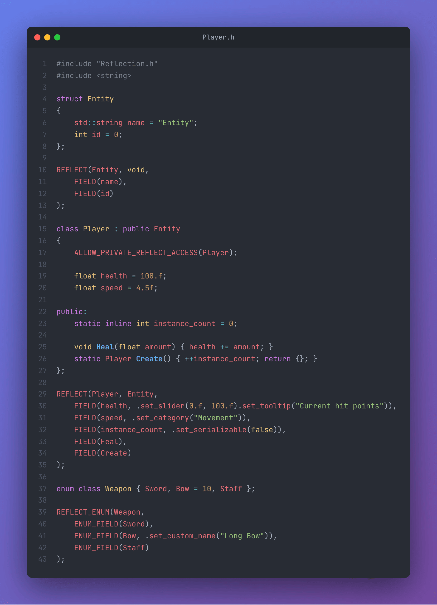

# Cpp-Reflection-20

A modern, header-only **C++20 reflection library**: describe your classes, templates and enums once with a few macros, then iterate over their members, read/write fields by name, call methods by name, attach editor metadata and convert enums to/from strings.


<p align="center">
  
  
</p>

---

## 📑 Table of Contents

- [Features](#-features)
- [Requirements](#-requirements)
- [Installation](#-installation)
- [Quick Start](#-quick-start)
- [Guide](#-guide)
  - [Reflecting a class](#reflecting-a-class)
  - [Inheritance](#inheritance)
  - [Private members](#private-members)
  - [Field metadata](#field-metadata)
  - [Templates](#templates)
  - [Enums](#enums)
- [API Reference](#-api-reference)
- [How It Works](#-how-it-works)
- [Known Limitations](#%EF%B8%8F-known-limitations)
- [Contributing](#-contributing)
- [Roadmap](#%EF%B8%8F-roadmap)

---

## 🎯 Features

- **C++20 Standard**: concepts, `constexpr`, designated initializers and fold expressions.
- **Header-Only**: drop `Reflection.h` in your project, no build step required.
- **Members, methods and statics**: data members, member functions, static members and static functions are reflected and sorted automatically.
- **Inheritance aware**: a reflected type exposes the fields of its reflected base class.
- **Templates**: reflect a class template once, every instantiation is reflected.
- **Enums**: value ↔ name conversion, custom display names, iteration over all values.
- **Metadata**: tooltip, category, slider range and serialization flag per field, ready for an editor or a serializer.
- **Compile-time field tables**: field lists are `constexpr` tuples, lookups use a FNV-1a hash of the name.
- **No External Dependencies**: only the standard library.

---

## 📋 Requirements

- C++20 compliant compiler:
  - MSVC 2019 16.10+
  - GCC 10+
  - Clang 12+
- CMake 3.28 or higher (for the test project)

---

## 📦 Installation

**Copy the header:** add `src/Reflection.h` to your include path.

**Or with CMake:**

```cmake
add_subdirectory(Cpp-Reflection-20)
target_link_libraries(MyProject PRIVATE Reflection)
```

The test executable `Reflection_Test` is only built when the library is the top-level project:

```bash
git clone https://github.com/Xanhos/Cpp-Reflection-20.git
cd Cpp-Reflection-20
cmake -B build
cmake --build build
./build/bin/Reflection_Test
```

---

## ⚡ Quick Start

```cpp
#include "Reflection.h"
#include <string>

struct Entity
{
    std::string name = "Entity";
    int id = 0;
};

REFLECT(Entity, void,
    FIELD(name),
    FIELD(id)
);

class Player : public Entity
{
    ALLOW_PRIVATE_REFLECT_ACCESS(Player);

    float health = 100.f;
    float speed = 4.5f;

public:
    static inline int instance_count = 0;

    void Heal(float amount) { health += amount; }
    static Player Create() { ++instance_count; return {}; }
};

REFLECT(Player, Entity,
    FIELD(health, .set_slider(0.f, 100.f).set_tooltip("Current hit points")),
    FIELD(speed, .set_category("Movement")),
    FIELD(instance_count, .set_serializable(false)),
    FIELD(Heal),
    FIELD(Create)
);

int main()
{
    using namespace Reflection;

    Player player = Player::Create();

    // Iterate over every data member, inherited ones included
    for_each_member(player, [](const char* name, auto& value)
    {
        std::cout << name << " = " << value << '\n';
    });

    // Read / write a member by name
    SetValue(player, "speed", 6.f);
    std::cout << "speed -> " << *GetValue<float>(player, "speed") << '\n';

    // Call a method by name
    auto heal = GetMethod<void(float), Player>("Heal");
    (player.*heal)(25.f);
    std::cout << "health -> " << *GetValue<float>(player, "health") << '\n';

    // Static members and static methods
    GetStaticMethod<Player(), Player>("Create")();
    std::cout << "instances -> " << *GetStaticMember<int, Player>("instance_count") << '\n';
}
```

Output:

```text
name = Entity
id = 0
health = 100
speed = 4.5
speed -> 6
health -> 125
instances -> 2
```

---

## 📖 Guide

### Reflecting a class

Place `REFLECT` **at global scope**, after the class definition:

```cpp
REFLECT(Type, BaseType, FIELD(member1), FIELD(member2), FIELD(Method), ...);
```

- `Type`: the reflected class.
- `BaseType`: its reflected parent, or `void`.
- `FIELD(name, metadata...)`: one entry per member, method, static member or static method. The library sorts them into `members`, `methods`, `static_members` and `static_methods` from the pointer type.

### Inheritance

When `BaseType` is itself reflected, its fields are prepended to the derived type's fields. In the Quick Start, `for_each_member(player, ...)` visits `name` and `id` from `Entity`, then `health` and `speed` from `Player`.

> Name lookups (`GetMember`, `GetValue`, `SetValue`) are typed with the class that **declares** the member: use `GetValue<std::string, Entity>(player, "name")` for an inherited field.

### Private members

Add `ALLOW_PRIVATE_REFLECT_ACCESS(Type)` inside the class (or `ALLOW_PRIVATE_TEMPLATE_REFLECT_ACCESS(Template)` for a template) to let the reflection data see private members.

### Field metadata

The optional second argument of `FIELD` chains setters on a `field_meta_data`:

| Setter | Stored in | Typical use |
| --- | --- | --- |
| `.set_slider(min, max)` | `slider.min`, `slider.max` | Editor slider range |
| `.set_tooltip("...")` | `tooltip` | Editor tooltip |
| `.set_category("...")` | `category` | Group fields in an inspector |
| `.set_serializable(false)` | `serializable` | Skip the field when saving |

```cpp
auto meta = Reflection::GetFieldMetaData<Player>("health");
std::cout << meta.tooltip << " [" << meta.slider.min << ", " << meta.slider.max << "]\n";
// Current hit points [0, 100]
```

`for_each_fields<T>(func)` gives access to the name, pointer, hash and metadata of every field, which is everything needed to generate an inspector or a serializer.

### Templates

```cpp
template<typename T>
struct Vec2
{
    T x{}, y{};
    T LengthSquared() { return x * x + y * y; }
};

REFLECT_TEMPLATE(Vec2, void,
    FIELD(x),
    FIELD(y),
    FIELD(LengthSquared)
);

Vec2<float> v{3.f, 4.f};
auto length = Reflection::GetMethod<float(), Vec2<float>>("LengthSquared");
std::cout << Reflection::TypeInfo<Vec2<float>>::name << ": " << (v.*length)() << '\n'; // Vec2: 25
```

### Enums

```cpp
enum class Weapon { Sword, Bow = 10, Staff };

REFLECT_ENUM(Weapon,
    ENUM_FIELD(Sword),
    ENUM_FIELD(Bow, .set_custom_name("Long Bow")),
    ENUM_FIELD(Staff)
);

Reflection::GetEnumName(Weapon::Bow);          // "Long Bow"  (custom name)
Reflection::GetEnumTrueName(Weapon::Bow);      // "Bow"       (identifier)
Reflection::GetEnumValue<Weapon>("Staff");     // Weapon::Staff (accepts both names)

for (const char* name : Reflection::GetAllEnumNames<Weapon>())
    std::cout << name << '\n';                 // Sword, Long Bow, Staff
```

---

## 📚 API Reference

All functions live in the `Reflection` namespace.

### Declaration macros

| Macro | Description |
| --- | --- |
| `REFLECT(Type, Base, fields...)` | Reflects a class. |
| `REFLECT_TEMPLATE(Template, Base, fields...)` | Reflects every instantiation of a class template. |
| `REFLECT_ENUM(Enum, values...)` | Reflects an enum. |
| `FIELD(name, metadata...)` | Declares a reflected member / method / static. |
| `ENUM_FIELD(value, metadata...)` | Declares a reflected enum value. |
| `ALLOW_PRIVATE_REFLECT_ACCESS(Type)` | Grants access to private members. |
| `ALLOW_PRIVATE_TEMPLATE_REFLECT_ACCESS(Template)` | Same, for templates. |

### Type information

| Symbol | Description |
| --- | --- |
| `TypeInfo<T>::name` | Type name as written in `REFLECT`. |
| `TypeInfo<T>::fields` / `members` / `methods` / `static_members` / `static_methods` | `constexpr` tuples of fields. |
| `TypeInfo<T>::exist_v` | `true` if `T` is reflected. |
| `IsReflectedType<T>` / `IsReflectedEnum<T>` | Concepts. |

### Members and methods

| Function | Description |
| --- | --- |
| `for_each_member(obj, func(name, value&))` | Visits every data member of `obj`. |
| `for_each_fields<T>(func(name, pointer, hash, meta))` | Visits every reflected field of `T`. |
| `GetValue<V>(obj, "name")` | Returns `V*` to the member (or `nullptr`). |
| `SetValue(obj, "name", value)` | Assigns a member by name. |
| `GetMember<V, T>("name")` | Returns the pointer-to-member `V T::*`. |
| `GetMethod<Signature, T>("name")` | Returns the pointer-to-member-function. |
| `GetStaticMember<V, T>("name")` | Returns `V*`. |
| `GetStaticMethod<Signature, T>("name")` | Returns a function pointer. |
| `GetFieldMetaData<T>("name")` | Returns the field's `field_meta_data`. |
| `Enable_Reflection_For_This<T>` | CRTP base exposing `GetMember`, `GetMethod`… directly on the object. |

### Enums

| Function | Description |
| --- | --- |
| `GetEnumName(value)` | Display name (custom name if set). |
| `GetEnumTrueName(value)` | Identifier as written in the code. |
| `GetEnumValue<E>("name")` | Value from its identifier or custom name. |
| `GetAllEnumNames<E>()` / `GetAllEnumTrueNames<E>()` / `GetAllEnumValue<E>()` | `std::vector` of all names / values. |
| `for_each_enum_fields<E>(func(name, value, hash, meta))` | Visits every enum value. |

---

## 🔧 How It Works

- `REFLECT` specializes `Reflection::TypeInfo<T>` with a `constexpr std::tuple` built by `FIELD`. Each entry stores the name, a pointer (to member, to member function, or a plain pointer for statics), the FNV-1a hash of the name and the metadata.
- `filter_fields` splits that tuple at compile time with type traits (`std::is_member_object_pointer`, `std::is_member_function_pointer`…).
- Name lookups compare hashes while walking the tuple, then return the pointer through `std::any` with the requested type.

---

## ⚠️ Known Limitations

- Name lookups are **typed**: the requested type must match the declared type exactly, otherwise a `bad_any_cast` message is printed and `nullptr` is returned.
- On GCC and Clang, include `<cstdint>` before `Reflection.h`, and avoid reflecting `const` member functions (the qualifier is removed with a cast that these compilers refuse in a constant expression).
- `InvokeMethod` builds its error with an MSVC-specific `std::exception` constructor.

---

## 🤝 Contributing

Contributions are welcome! Please feel free to submit issues, fork the repository, and create pull requests.

### Development Guidelines

1. Maintain C++20 standard compliance
2. Ensure all code is `constexpr` where possible
3. Update documentation accordingly

---

## 🗺️ Roadmap

- [ ] Add wrapper for member

---

## 📮 Contact

For questions, suggestions, or bug reports, please open an issue on [GitHub](https://github.com/Xanhos/Cpp-Reflection-20/issues).

---

**Version**: 1.2
**Last Updated**: December 2025
